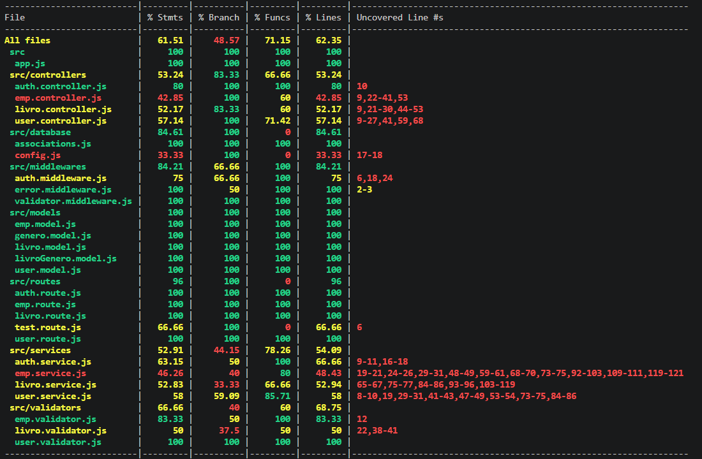
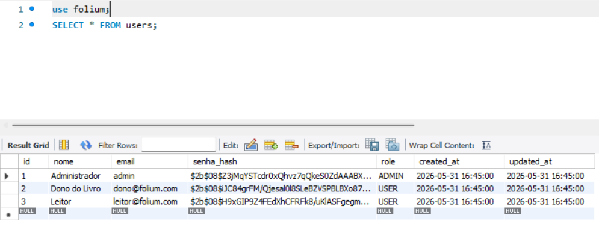
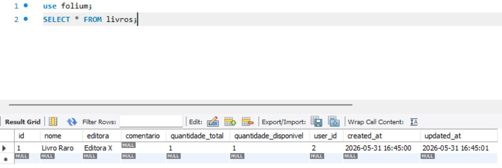
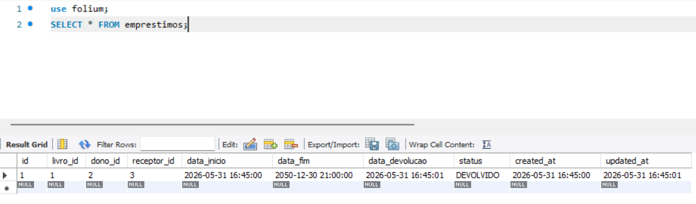
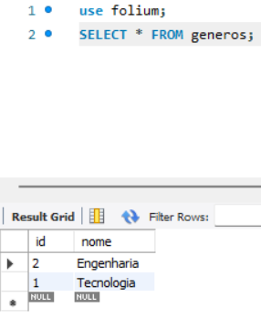
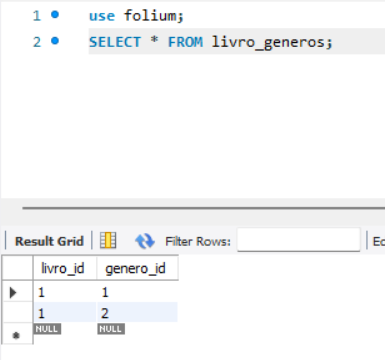

# Documentação de Testes Automatizados — MVP Folium

## 1. Objetivo e Escopo
Este documento detalha os testes automatizados implementados para o Produto Mínimo Viável (MVP) do projeto **Folium**, atendendo aos requisitos da disciplina de Engenharia de Software. O foco do MVP é o ciclo central de gerenciamento de livros e empréstimos.

A estrutura escolhida para validação primária foi a camada de serviços (`LivroService` e `EmprestimoService`), pois ela concentra as regras de negócio mais cruciais da aplicação, garantindo a integridade dos dados e o controle de estoque antes da interação com o banco de dados.

## 2. Estratégia e Cenários de Teste
Os testes foram construídos utilizando as bibliotecas **Jest** e **Supertest**. A estratégia adotada foi o Teste de Integração de API, simulando requisições HTTP reais que exercitam o sistema de ponta a ponta. O teste abrange os seguintes cenários:

* **Autenticação e Permissões:** Criação de usuários, geração de tokens JWT, atualização de perfis e validação de privilégios de Administrador.
* **Gerenciamento de Acervo:** Validação de *inputs* (ex: bloqueio de quantidade negativa), criação de livros associados a gêneros (tabela pivô) e filtros de listagem.
* **Ciclo de Empréstimos:** Validação de restrições de negócio (dono não pode pegar o próprio livro, bloqueio em caso de estoque indisponível), registro de devolução e alteração forçada de status via Admin.

## 3. Cobertura de Código
A meta estabelecida para a atividade foi de, no mínimo, 60% de cobertura para uma classe, mas ampliamos para termos uma melhor visualiação do fluxo da API. Após a execução da suíte com a flag de monitoramento (comando `npm test -- --coverage`), o sistema registrou **62.35%** de cobertura global de linhas (`% Lines`), além de boa cobertura nas validações e ramificações críticas dos *Services*, cumprindo os requisitos com sucesso.

## 4. Resultado no Terminal (Print Screen)
Abaixo está o registro da execução bem-sucedida dos testes e a tabela de cobertura gerada pelo Jest:

Tabela users MySQL: 

Tabela livros MySQL: 

Tabela emprestimos MySQL: 

Tabela generos MySQL: 

Tabela generos dos livros MySQL: 
